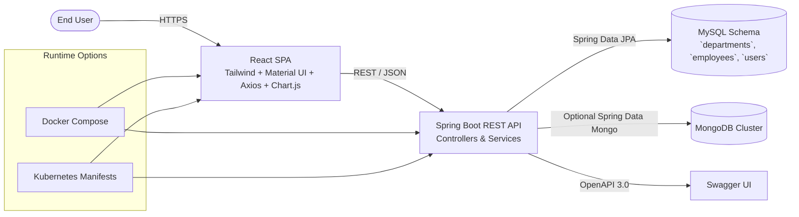
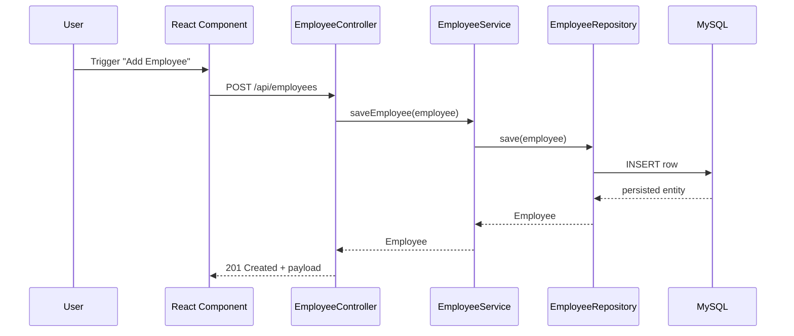

# Employee Management Full-Stack Application

The **Employee Management Full-Stack Application** is a modern, feature-rich system for managing employee and department data, built to demonstrate the power of combining traditional enterprise technologies with modern web frameworks. It leverages a responsive React frontend alongside a robust Spring Boot backend, delivering a seamless user experience with features such as CRUD operations, data visualization, authentication, and secure REST APIs. Designed with scalability and maintainability in mind, this application is also fully containerized with Docker, orchestrated with Kubernetes, and supports CI/CD pipelines through Jenkins, making it an ideal blueprint for real-world enterprise applications.

## Overview

The Employee Management System is a dynamic full-stack application that seamlessly combines cutting-edge and traditional technologies. By integrating a modern **React** frontend with a classic **Spring Boot** backend, this project demonstrates how new and established technologies can harmoniously work together to create a robust and efficient application for managing employee and department data!

## Architecture at a Glance

- React SPA (Material UI, Tailwind CSS, Chart.js) consumes the Spring Boot REST API over HTTPS via Axios.
- Spring Boot layers (controller → service → repository) persist to MySQL through Spring Data JPA and seed demo data with Faker-powered `DataInitializer`.
- Operability tooling includes Docker Compose for local orchestration, Kubernetes manifests for cluster deployments, Terraform blueprints, and a Jenkins pipeline for frontend build verification.

### System Context

### Request Lifecycle

gement-full-stack-application)**
